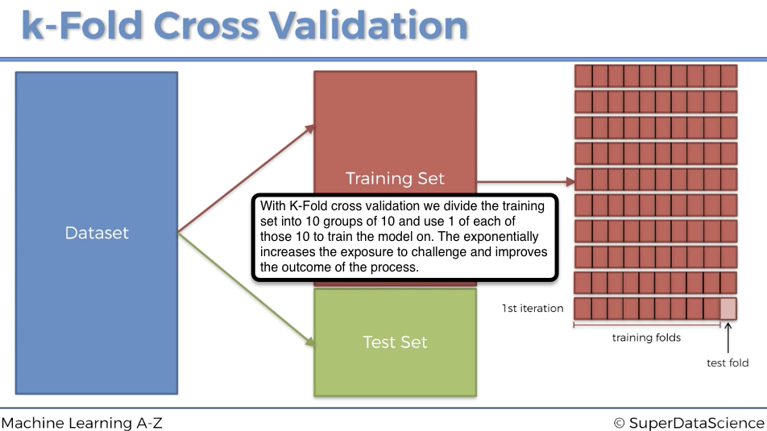

# Grid Search
Basic explanations:  
Lecture 286 https://www.udemy.com/machinelearning/learn/lecture/6453728  
https://medium.com/datadriveninvestor/an-introduction-to-grid-search-ff57adcc0998  
https://towardsdatascience.com/grid-search-for-model-tuning-3319b259367e  
Well done description of process with some other data.  
https://towardsdatascience.com/grid-search-for-model-tuning-3319b259367e  
Pieces of code for above https://gist.github.com/rohanjoseph93  

```{r, include=FALSE}
getwd()
```

# Importing the dataset
```{r, include=TRUE}
dataset = read.csv('Social_Network_Ads.csv')
dataset = dataset[3:5]
```

# Encoding the target feature as factor
```{r, include=TRUE}
dataset$Purchased = factor(dataset$Purchased, levels = c(0, 1))
```

# Splitting the dataset into the Training set and Test set
```{r, include=TRUE}
# install.packages('caTools')
library(caTools)
set.seed(123)
split = sample.split(dataset$Purchased, SplitRatio = 0.75)
training_set = subset(dataset, split == TRUE)
test_set = subset(dataset, split == FALSE)
```

# Feature Scaling
```{r, include=TRUE}
training_set[-3] = scale(training_set[-3])
test_set[-3] = scale(test_set[-3])
```

# Applying Grid Search to find the best parameters
Lecture 286 https://www.udemy.com/machinelearning/learn/lecture/6453728  
```{r, include=TRUE}
# install.packages('caret')
library(caret)
# here is where we setup the grid seach mechanism
classifier = train(form = Purchased ~ ., data = training_set, method = 'svmRadial')
```
```{r, include=TRUE}
classifier
```
Lets strip that down to only the best values for Sigma and C. 
```{r, include=TRUE}
classifier$bestTune
```

# Predicting the Test set results
```{r, include=TRUE}
y_pred = predict(classifier, newdata = test_set[-3])
```

# Making the Confusion Matrix
```{r, include=TRUE}
cm = table(test_set[, 3], y_pred)
```
```{r, include=TRUE}
cm
```
# Visualising the Training set results
```{r, include=TRUE}
library(ElemStatLearn)
set = training_set
X1 = seq(min(set[, 1]) - 1, max(set[, 1]) + 1, by = 0.01)
X2 = seq(min(set[, 2]) - 1, max(set[, 2]) + 1, by = 0.01)
grid_set = expand.grid(X1, X2)
colnames(grid_set) = c('Age', 'EstimatedSalary')
y_grid = predict(classifier, newdata = grid_set)
plot(set[, -3],
     main = 'Kernel SVM (Training set)',
     xlab = 'Age', ylab = 'Estimated Salary',
     xlim = range(X1), ylim = range(X2))
contour(X1, X2, matrix(as.numeric(y_grid), length(X1), length(X2)), add = TRUE)
points(grid_set, pch = '.', col = ifelse(y_grid == 1, 'springgreen3', 'tomato'))
points(set, pch = 21, bg = ifelse(set[, 3] == 1, 'green4', 'red3'))
```

# Visualising the Test set results
```{r, include=TRUE}
library(ElemStatLearn)
set = test_set
X1 = seq(min(set[, 1]) - 1, max(set[, 1]) + 1, by = 0.01)
X2 = seq(min(set[, 2]) - 1, max(set[, 2]) + 1, by = 0.01)
grid_set = expand.grid(X1, X2)
colnames(grid_set) = c('Age', 'EstimatedSalary')
y_grid = predict(classifier, newdata = grid_set)
plot(set[, -3], main = 'Kernel SVM (Test set)',
     xlab = 'Age', ylab = 'Estimated Salary',
     xlim = range(X1), ylim = range(X2))
contour(X1, X2, matrix(as.numeric(y_grid), length(X1), length(X2)), add = TRUE)
points(grid_set, pch = '.', col = ifelse(y_grid == 1, 'springgreen3', 'tomato'))
points(set, pch = 21, bg = ifelse(set[, 3] == 1, 'green4', 'red3'))
```


===============================================

# Now, what you can do.
We could take the above and work the sigma and C values into the old way of doing the model build (classifier) or we could just use the Classifier we made above. 

# Fitting Kernel SVM to the Training set - the old way
We'll use SVM but we could be using any algorithm that would be best for the data, more on that in Grid Search which is next. Additionally here with algorithm selection it's important to have some sense of the algorithm and your data and do they compliment one another properly. 

```{r, include=TRUE}
# install.packages('e1071')
library(e1071)
classifierO = svm(formula = Purchased ~ .,
                 data = training_set,
                 type = 'C-classification',
                 kernel = 'radial')
```

# Predicting the Test set results
```{r, include=TRUE}
y_predO = predict(classifierO, newdata = test_set[-3])
```

# Making the Confusion Matrix
```{r, include=TRUE}
cmO = table(test_set[, 3], y_predO)
```
```{r, include=TRUE}
cmO
```
# Applying k-Fold Cross Validation
# What is K-Fold
The name comes from the idea that we are creating K # of folds; each iteration is called a fold. 10 is the most common # of folds. Once the process is complete we'll be able to see elements of the 10 iterations such as Mean and Standard Deviation.  
```{r, echo=TRUE, fig.cap="What are we doing with K-fold?", out.width = '100%'}

```

```{r, include=TRUE}
# install.packages('caret')
library(caret)
folds = createFolds(training_set$Purchased, k = 10)
cv = lapply(folds, function(x) {
  training_fold = training_set[-x, ]
  test_fold = training_set[x, ]
  classifierO = svm(formula = Purchased ~ .,
                   data = training_fold,
                   type = 'C-classification',
                   kernel = 'radial')
  y_predO = predict(classifierO, newdata = test_fold[-3])
  cmO = table(test_fold[, 3], y_predO)
  accuracy = (cmO[1,1] + cmO[2,2]) / (cmO[1,1] + cmO[2,2] + cmO[1,2] + cmO[2,1])
  return(accuracy)
})
accuracy = mean(as.numeric(cv))
```

```{r, include=TRUE}
accuracy
```

# Visualising the Training set results
```{r, include=TRUE}
library(ElemStatLearn)
set = training_set
X1 = seq(min(set[, 1]) - 1, max(set[, 1]) + 1, by = 0.01)
X2 = seq(min(set[, 2]) - 1, max(set[, 2]) + 1, by = 0.01)
grid_set = expand.grid(X1, X2)
colnames(grid_set) = c('Age', 'EstimatedSalary')
y_gridO = predict(classifier, newdata = grid_set)
plot(set[, -3],
     main = 'Kernel SVM old way (Training set)',
     xlab = 'Age', ylab = 'Estimated Salary',
     xlim = range(X1), ylim = range(X2))
contour(X1, X2, matrix(as.numeric(y_gridO), length(X1), length(X2)), add = TRUE)
points(grid_set, pch = '.', col = ifelse(y_gridO == 1, 'springgreen3', 'tomato'))
points(set, pch = 21, bg = ifelse(set[, 3] == 1, 'green4', 'red3'))
```

# Visualising the Test set results
```{r, include=TRUE}
library(ElemStatLearn)
set = test_set
X1 = seq(min(set[, 1]) - 1, max(set[, 1]) + 1, by = 0.01)
X2 = seq(min(set[, 2]) - 1, max(set[, 2]) + 1, by = 0.01)
grid_set = expand.grid(X1, X2)
colnames(grid_set) = c('Age', 'EstimatedSalary')
y_gridO = predict(classifier, newdata = grid_set)
plot(set[, -3], main = 'Kernel SVM old way (Test set)',
     xlab = 'Age', ylab = 'Estimated Salary',
     xlim = range(X1), ylim = range(X2))
contour(X1, X2, matrix(as.numeric(y_gridO), length(X1), length(X2)), add = TRUE)
points(grid_set, pch = '.', col = ifelse(y_gridO == 1, 'springgreen3', 'tomato'))
points(set, pch = 21, bg = ifelse(set[, 3] == 1, 'green4', 'red3'))
```
