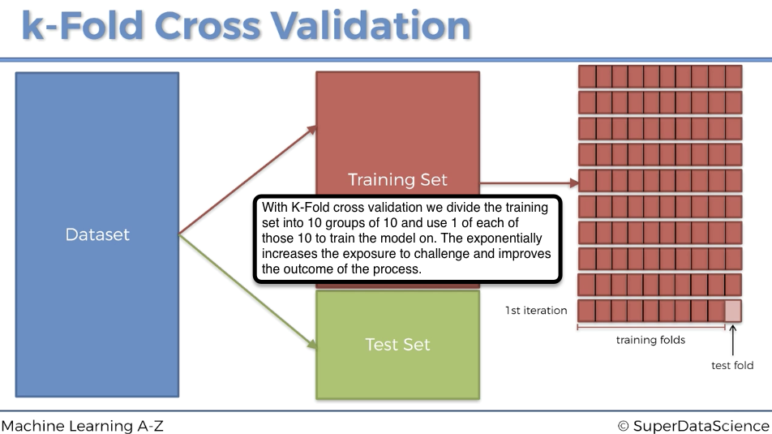
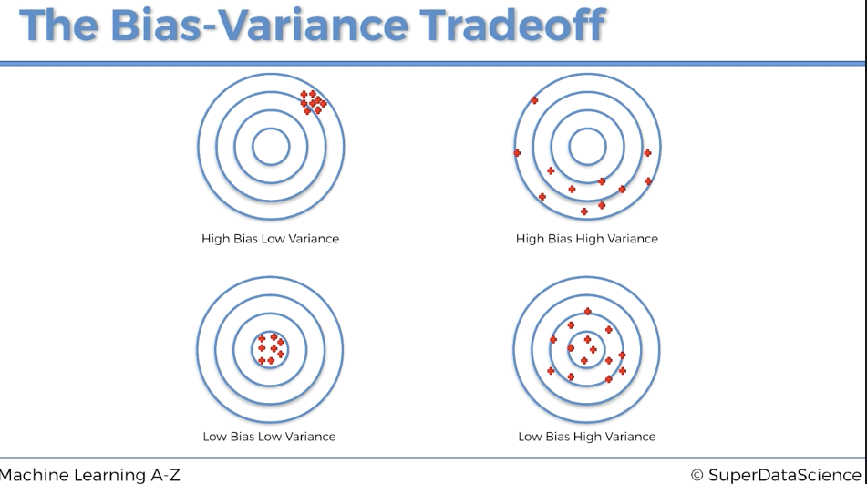
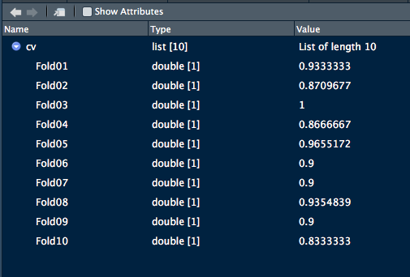

# k-Fold Cross Validation

Lecture 282 https://www.udemy.com/machinelearning/learn/lecture/6453704 good lecture. 

Widipedia on Cross Validation   https://en.wikipedia.org/wiki/Cross-validation_(statistics)#k-fold_cross-validation  

Well done description of process with some other data.  
https://towardsdatascience.com/grid-search-for-model-tuning-3319b259367e  
Pieces of code for above https://gist.github.com/rohanjoseph93  

# What is K-Fold
The name comes from the idea that we are creating K # of folds; each iteration is called a fold. 10 is the most common # of folds. Once the process is complete we'll be able to see elements of the 10 iterations such as Mean and Standard Deviation.  
```{r, echo=TRUE, fig.cap="What are we doing with K-fold?", out.width = '100%'}

```
# The Bias Variance 
We'll have some very relevant methods to see how well the K-Fold process has worked. 
```{r, echo=TRUE, fig.cap="What are we doing with K-fold?", out.width = '100%'}

```

```{r, include=FALSE}
getwd()
```

# Importing the dataset
```{r, include=TRUE}
dataset = read.csv('Social_Network_Ads.csv')
dataset = dataset[3:5]
```


# Encoding the target feature (Purchased) as factor
```{r, include=TRUE}
dataset$Purchased = factor(dataset$Purchased, levels = c(0, 1))
```

# Splitting the dataset into the Training set and Test set
```{r, include=TRUE}
# install.packages('caTools')
library(caTools)
set.seed(123)
split = sample.split(dataset$Purchased, SplitRatio = 0.75)
training_set = subset(dataset, split == TRUE)
test_set = subset(dataset, split == FALSE)
```

# Feature Scaling
```{r, include=TRUE}
training_set[-3] = scale(training_set[-3])
test_set[-3] = scale(test_set[-3])
```

# Fitting Kernel SVM to the Training set
We'll use SVM but we could be using any algorithm that would be best for the data, more on that in Grid Search which is next. Additionally here with algorithm selection it's important to have some sense of the algorithm and your data and do they compliment one another properly. 
```{r, include=TRUE}
# install.packages('e1071')
library(e1071)
classifier = svm(formula = Purchased ~ .,
                 data = training_set,
                 type = 'C-classification',
                 kernel = 'radial')
```

# Predicting the Test set results
```{r, include=TRUE}
y_pred = predict(classifier, newdata = test_set[-3])
```
# Making the Confusion Matrix
There's a cool way to graph the CM, well really visualize it. 
```{r, include=TRUE}
cm = table(test_set[, 3], y_pred)
cm
```
# Applying k-Fold Cross Validation
The real meat of this exercise. 
```{r, include=TRUE}
# install.packages('caret')
library(caret)
# in creating the folds we specify the target feature (dependent variable) and # of folds
folds = createFolds(training_set$Purchased, k = 10)
# in cv we are going to applying a created function to our 'folds'
cv = lapply(folds, function(x) { # start of function
  # in the next two lines we will separate the Training set into it's 10 pieces
  training_fold = training_set[-x, ] # training fold =  training set minus (-) it's sub test fold
  test_fold = training_set[x, ] # here we describe the test fold individually
  # now apply (train) the classifer on the training_fold
  classifier = svm(formula = Purchased ~ .,
                   data = training_fold,
                   type = 'C-classification',
                   kernel = 'radial')
  # next step in the loop, we calculate the predictions and cm and we equate the accuracy
  # note we are training on training_fold and testing its accuracy on the test_fold
  y_pred = predict(classifier, newdata = test_fold[-3])
  cm = table(test_fold[, 3], y_pred)
  accuracy = (cm[1,1] + cm[2,2]) / (cm[1,1] + cm[2,2] + cm[1,2] + cm[2,1])
  return(accuracy)
})
```
For CV we can see we have 10 folds/iterations each with slight variations of accuracy. 
```{r, echo=TRUE, fig.cap="What are we doing with K-fold?", out.width = '100%'}

```
# mean of accuracy
```{r, include=TRUE}
accuracy = mean(as.numeric(cv))
accuracy
```

# Visualising the Training set results
```{r, include=TRUE}
library(ElemStatLearn)
set = training_set
X1 = seq(min(set[, 1]) - 1, max(set[, 1]) + 1, by = 0.01)
X2 = seq(min(set[, 2]) - 1, max(set[, 2]) + 1, by = 0.01)
grid_set = expand.grid(X1, X2)
colnames(grid_set) = c('Age', 'EstimatedSalary')
y_grid = predict(classifier, newdata = grid_set)
plot(set[, -3],
     main = 'Kernel SVM (Training set)',
     xlab = 'Age', ylab = 'Estimated Salary',
     xlim = range(X1), ylim = range(X2))
contour(X1, X2, matrix(as.numeric(y_grid), length(X1), length(X2)), add = TRUE)
points(grid_set, pch = '.', col = ifelse(y_grid == 1, 'springgreen3', 'tomato'))
points(set, pch = 21, bg = ifelse(set[, 3] == 1, 'green4', 'red3'))
```

# Visualising the Test set results
```{r, include=TRUE}
library(ElemStatLearn)
set = test_set
X1 = seq(min(set[, 1]) - 1, max(set[, 1]) + 1, by = 0.01)
X2 = seq(min(set[, 2]) - 1, max(set[, 2]) + 1, by = 0.01)
grid_set = expand.grid(X1, X2)
colnames(grid_set) = c('Age', 'EstimatedSalary')
y_grid = predict(classifier, newdata = grid_set)
plot(set[, -3], main = 'Kernel SVM (Test set)',
     xlab = 'Age', ylab = 'Estimated Salary',
     xlim = range(X1), ylim = range(X2))
contour(X1, X2, matrix(as.numeric(y_grid), length(X1), length(X2)), add = TRUE)
points(grid_set, pch = '.', col = ifelse(y_grid == 1, 'springgreen3', 'tomato'))
points(set, pch = 21, bg = ifelse(set[, 3] == 1, 'green4', 'red3'))
```


