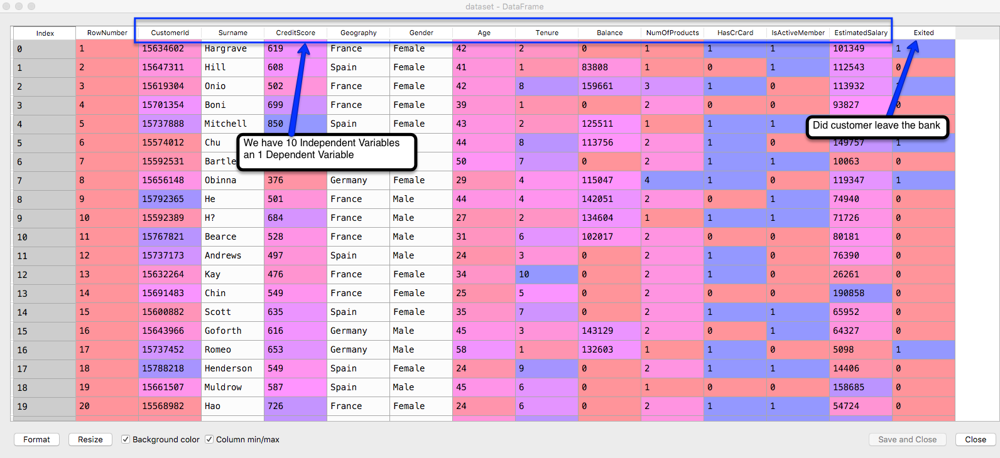

# XGBoost
A form of gradient boosting. 
Lecture 290 https://www.udemy.com/machinelearning/learn/lecture/6453764  

# Benefits of XGBoost
High performance  
Fast exectution  
We can keep all the interpretation of your problem, aka there's isn't all the fixing of stuff like country by making dummy variables. 


```{r, include=FALSE}
getwd()
```

# Importing the dataset
```{r, include=FALSE}
dataset = read.csv('Churn_Modelling.csv')
# we only need the features (independent variables) we don't need the dependent variable
# we've removed the 1st three columns because they have no impact on the dependent variable
dataset = dataset[4:14]
```

```{r, echo=TRUE, fig.cap="What are we doing with K-fold?", out.width = '100%'}

```

# Encoding the categorical variables as factors
```{r, include=FALSE}
dataset$Geography = as.numeric(factor(dataset$Geography,
                                      levels = c('France', 'Spain', 'Germany'),
                                      labels = c(1, 2, 3)))
dataset$Gender = as.numeric(factor(dataset$Gender,
                                   levels = c('Female', 'Male'),
                                   labels = c(1, 2)))
```

# Splitting the dataset into the Training set and Test set
```{r, include=FALSE}
# install.packages('caTools')
library(caTools)
set.seed(123)
split = sample.split(dataset$Exited, SplitRatio = 0.8)
training_set = subset(dataset, split == TRUE)
test_set = subset(dataset, split == FALSE)
```

# Fitting XGBoost to the Training set
```{r, include=FALSE}
# install.packages('xgboost')
library(xgboost)
# the -11 references our removal of the dependent variable
# we have a dataframe and we need a matrix so we use as.matrix
classifier = xgboost(data = as.matrix(training_set[-11]), label = training_set$Exited, nrounds = 10)
```

# Predicting the Test set results
```{r, include=FALSE}
y_pred = predict(classifier, newdata = as.matrix(test_set[-11]))
y_pred = (y_pred >= 0.5)
```

# Making the Confusion Matrix
```{r, include=FALSE}
cm = table(test_set[, 11], y_pred)
```

# Applying k-Fold Cross Validation
```{r, include=FALSE}
# install.packages('caret')
library(caret)
folds = createFolds(training_set$Exited, k = 10)
cv = lapply(folds, function(x) {
  training_fold = training_set[-x, ]
  test_fold = training_set[x, ]
  classifier = xgboost(data = as.matrix(training_fold[-11]), label = training_fold$Exited, nrounds = 10)
  y_pred = predict(classifier, newdata = as.matrix(test_fold[-11]))
  y_pred = (y_pred >= 0.5)
  cm = table(test_fold[, 11], y_pred)
  accuracy = (cm[1,1] + cm[2,2]) / (cm[1,1] + cm[2,2] + cm[1,2] + cm[2,1])
  return(accuracy)
})
accuracy = mean(as.numeric(cv))
```