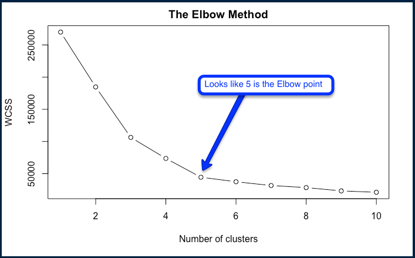

K Means Intuition Lecture 137 https://www.udemy.com/machinelearning/learn/lecture/5714416

https://en.wikipedia.org/wiki/K-means_clustering

K Means Random Initialization Trap Lecture 138 https://www.udemy.com/machinelearning/learn/lecture/5714420 This references the idea that our selection of the initial centroids can impact the end result of our clusters. The solution to this is K-Means++ which is something that thankfully is included in the background of the K means cluster algorithms that are available. 

## Within Cluster Sum of Squares
K Means Selecting the number of clusters Lecture 139 https://www.udemy.com/machinelearning/learn/lecture/5714426 
within cluster sum of squares is the answer. The method we'll use is the Elbow method ;) We can calculate the Within Cluster Sum of Squares.

```{r, echo=TRUE, fig.cap="A caption", out.width = '100%'}
knitr::include_graphics("/Users/markloessi/Machine_Learning/TheElbowMethodClusteringNums.png")
```

K Means Clustering R Lecture 142 https://www.udemy.com/machinelearning/learn/lecture/5685594

Clustering is similar to classification, but the basis is different. In Clustering you don’t know what you are looking for, and you are trying to identify some segments or clusters in your data. When you use clustering algorithms on your dataset, unexpected things can suddenly pop up like structures, clusters and groupings you would have never thought of otherwise.
```{r , include=TRUE}
dataset = read.csv('Mall_Customers.csv')
```
Quick look
```{r , include=TRUE}
summary(dataset)
```
Another look
```{r , include=TRUE}
head(dataset)
```
Now we want to build an array of our two columns we want to test.
```{r , include=TRUE}
dataset = dataset[4:5]
```
Quick look
```{r , include=TRUE}
summary(dataset)
```
Another look
```{r , include=TRUE}
head(dataset)
```

Splitting the dataset into the Training set and Test set - won't be done for KMeans

Feature Scaling - won't be done for KMeans

# Using the elbow method to find the 'optimal' number of clusters
The elbow method via determining the Within Clusters Sum of Squares
```{r , include=TRUE}
set.seed(6)
# make an empty vector we'll populate via our loop
wcss = vector()
# for our 10 clusters we'll start with
for (i in 1:10) wcss[i] <- sum(kmeans(dataset, i)$withinss)
plot(1:10,
     wcss,
     type = 'b', # for lines and points
     main = paste('The Elbow Method'),
     xlab = 'Number of clusters',
     ylab = 'WCSS')
```

Let's interpret;
```{r, echo=TRUE, fig.cap="A caption", out.width = '100%'}

```

# Fitting K-Means to the dataset
And adjusting the clusters to 5 based on our analysis
```{r , include=TRUE}
set.seed(29)
kmeans = kmeans(x = dataset, centers = 5, iter.max = 300, nstart = 10)
y_kmeans = kmeans$cluster
```
# Visualising the clusters
This code is only for 2 dimensional clustering. 
```{r , include=TRUE}
library(cluster)
clusplot(dataset,
         y_kmeans,
         lines = 0,
         shade = TRUE,
         color = TRUE,
         labels = 2,
         plotchar = FALSE,
         span = TRUE,
         main = paste('Clusters of customers'),
         xlab = 'Annual Income',
         ylab = 'Spending Score')
```

