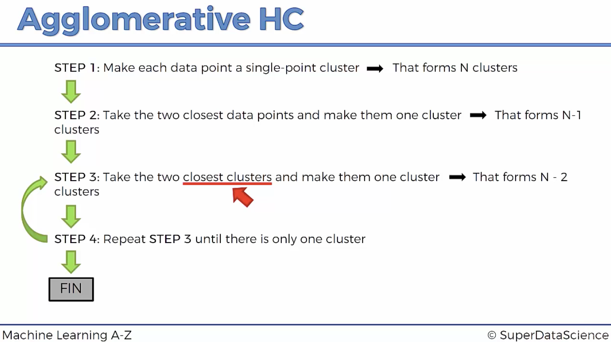
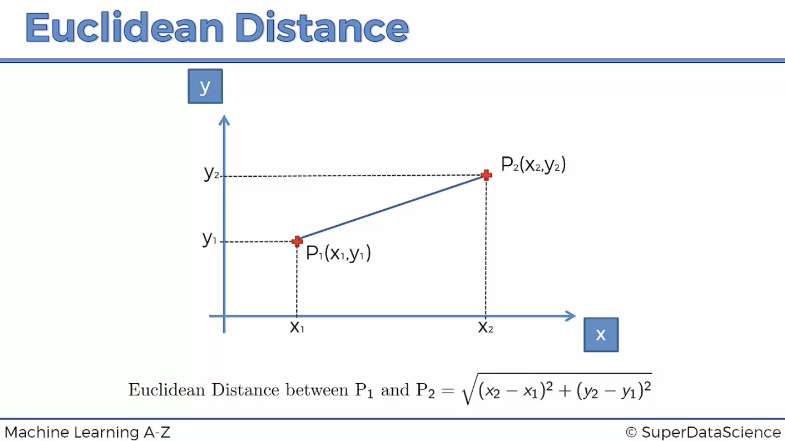
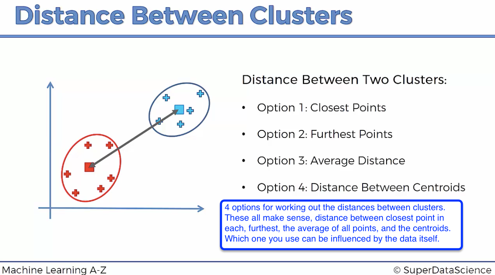
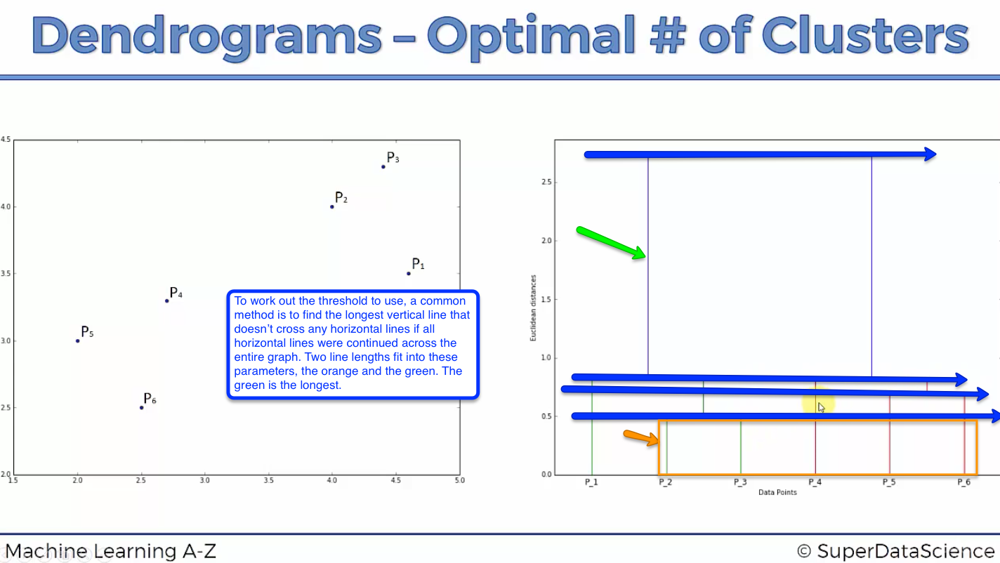
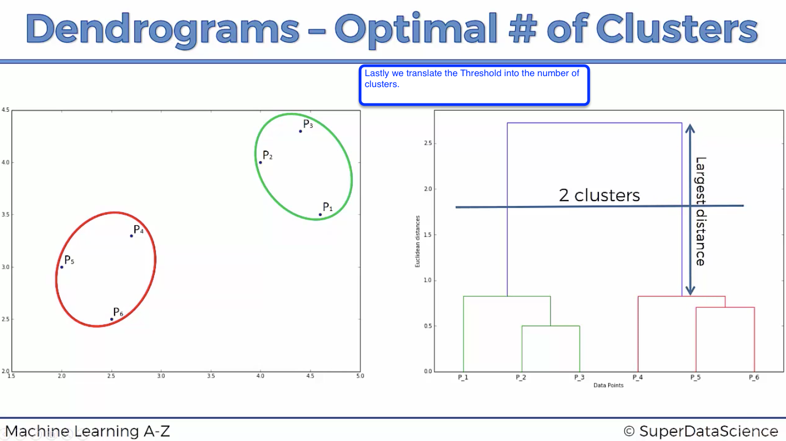
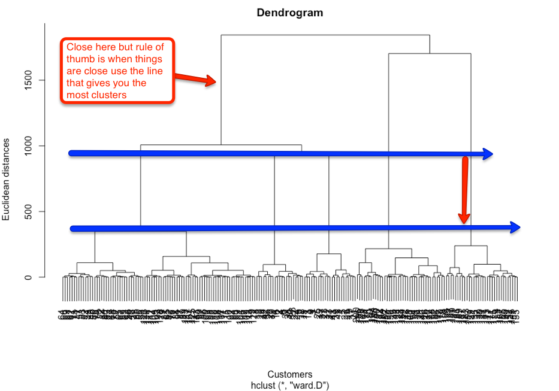
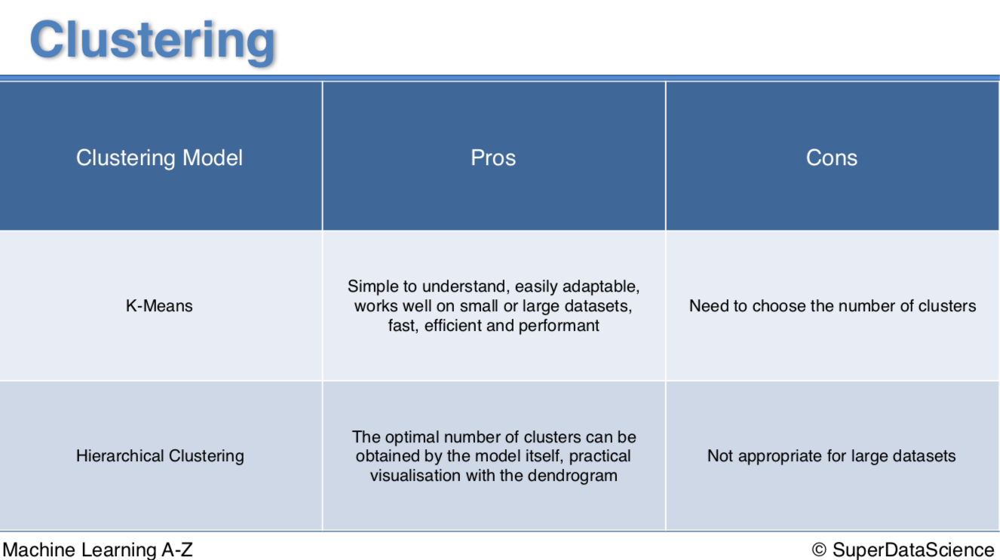

# Hierarchical Clustering
HC Intuition Lecture 143 https://www.udemy.com/machinelearning/learn/lecture/5714428

In data mining and statistics, hierarchical clustering (also called hierarchical cluster analysis or HCA) is a method of cluster analysis which seeks to build a hierarchy of clusters. Strategies for hierarchical clustering generally fall into two types:[1]

Agglomerative: This is a "bottom-up" approach: each observation starts in its own cluster, and pairs of clusters are merged as one moves up the hierarchy.
Divisive: This is a "top-down" approach: all observations start in one cluster, and splits are performed recursively as one moves down the hierarchy.

In general, the merges and splits are determined in a greedy manner. The results of hierarchical clustering are usually presented in a dendrogram.

https://en.wikipedia.org/wiki/Hierarchical_clustering

check working directory getwd()
```{r, include=FALSE}
getwd()
```

# Hierachical Clustering Steps
```{r, echo=TRUE, fig.cap="A caption", out.width = '100%'}

```
# What's going on here
Lets remember Euclidean Distances as this is an important element (distances) in the clustering steps. 
```{r, echo=TRUE, fig.cap="A caption", out.width = '100%'}

```

see minute 6:36 in intuition lecture above for visual walk through of steps

# Working out the distances between clusters
```{r, echo=TRUE, fig.cap="A caption", out.width = '100%'}

```

# How the Dendogram works
What the Hierachical Clustering algorithm does while it walks through the steps
above is stores the memory of the steps in a Dendrogram :-)

https://en.wikipedia.org/wiki/Dendrogram

https://www.udemy.com/machinelearning/learn/lecture/5714432
Basically how is the Dendogram created. 

```{r, echo=TRUE, fig.cap="A caption", out.width = '100%'}
knitr::include_graphics("How_Dendogram_Forms.png")
```

What we do is set a dissimilarity threshold based on a certain Euclidean Distance. We can work how where to set this by visualizing the Dendogram. 

# Dendogram Threshold
```{r, echo=TRUE, fig.cap="A caption", out.width = '100%'}

```

# Threshold into Cluster Count
```{r, echo=TRUE, fig.cap="A caption", out.width = '100%'}

```

# Import data
```{r , include=TRUE}
dataset = read.csv('Mall_Customers.csv')
```
What's this about
```{r, echo=TRUE, fig.cap="A caption", out.width = '100%'}
knitr::include_graphics("/Users/markloessi/Machine_Learning/Machine Learning A-Z New/Part 4 - Clustering/MallCustomer_Task.png")
```
Quick look
```{r , include=TRUE}
summary(dataset)
```
Another look
```{r , include=TRUE}
head(dataset)
```
# Build array
Now we want to build an array of our two columns we want to test.
```{r , include=TRUE}
X = dataset[4:5] # to follow lecture
dataset = dataset[4:5] # documentation
```
Quick look
```{r , include=TRUE}
summary(dataset)
```
Another look
```{r , include=TRUE}
head(dataset)
```

Splitting the dataset into the Training set and Test set - won't be done for KMeans

Feature Scaling - won't be done for KMeans

# Using the dendrogram to find the optimal number of clusters
```{r , include=TRUE, fig.width=10, fig.height=7}
# the ward.D method tries to minimize the within cluster variance
dendrogram = hclust(d = dist(dataset, method = 'euclidean'), method = 'ward.D')
plot(dendrogram,
     main = paste('Dendrogram'),
     xlab = 'Customers',
     ylab = 'Euclidean distances')
```

Let's interpret;
```{r, echo=TRUE, fig.cap="A caption", out.width = '100%'}

```

# Fitting Hierachical Clustering to the dataset
And adjusting the clusters to 5 based on our analysis
```{r , include=TRUE}
# we're going to make another object
hc = hclust(d = dist(dataset, method = 'euclidean'), method = 'ward.D')
# then fit it again to our data, note we are 'cutting' the tree where we get 5 clusters ;-)
y_hc = cutree(hc, 5)
```
# Visualising the clusters
This code is only for 2 dimensional clustering. 
```{r , include=TRUE, fig.width=10, fig.height=7}
library(cluster)
clusplot(dataset,
         y_hc,
         lines = 0,
         shade = TRUE,
         color = TRUE,
         labels= 2,
         plotchar = FALSE,
         span = TRUE,
         main = paste('Clusters of customers'),
         xlab = 'Annual Income',
         ylab = 'Spending Score')
```

# Clustering Pros Cons
```{r, echo=TRUE, fig.cap="A caption", out.width = '100%'}

```

=========================  
Github files; https://github.com/ghettocounselor

Useful PDF for common questions in Lectures;  
https://github.com/ghettocounselor/Machine_Learning/blob/master/Machine-Learning-A-Z-Q-A.pdf