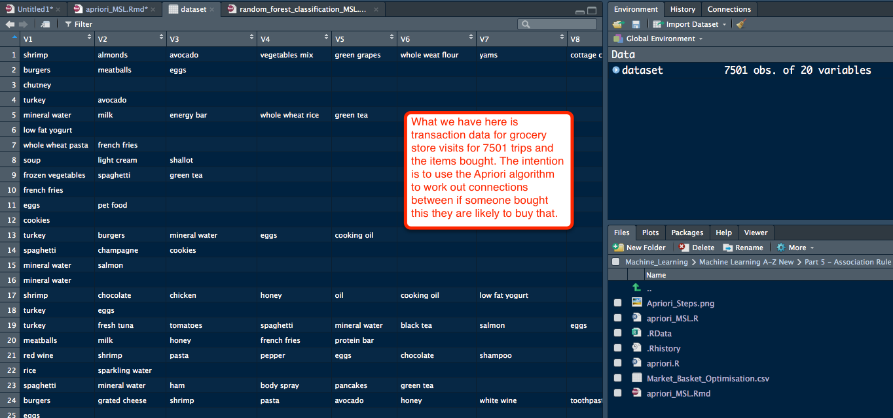
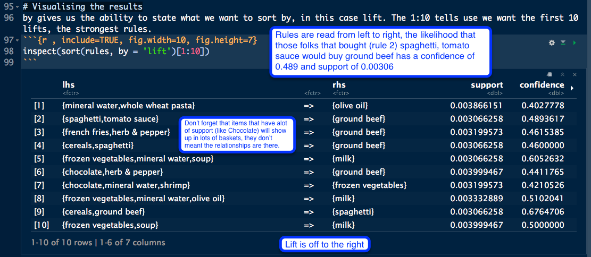

Intuition Lecture 159 https://www.udemy.com/machinelearning/learn/lecture/6455322

R Lectures:

161 https://www.udemy.com/machinelearning/learn/lecture/5921986

162 https://www.udemy.com/machinelearning/learn/lecture/5927156

163 https://www.udemy.com/machinelearning/learn/lecture/5932642

https://en.wikipedia.org/wiki/Association_rule_learning

https://en.wikipedia.org/wiki/Apriori_algorithm

# Overview
The Apriori (reference to prior knowledge) algorithm was proposed by Agrawal and Srikant in 1994. Apriori is designed to operate on databases containing transactions, for example, collections of items bought by customers, or details of a website frequentation or IP addresses. 

Other algorithms are designed for finding association rules in data having no 
transactions (Winepi and Minepi), or having no timestamps (DNA sequencing). 
Each transaction is seen as a set of items (an itemset). Given a threshold 
{\displaystyle C} C, the Apriori algorithm identifies the item sets which are 
subsets of at least {\displaystyle C} C transactions in the database.

Apriori uses a "bottom up" approach, where frequent subsets are extended one 
item at a time (a step known as candidate generation), and groups of candidates 
are tested against the data; people who bought beer also bought diapers, people who bought diapers also bought laundry detergent, and so on. The algorithm terminates when no further successful extensions are found.

Apriori uses breadth-first search and a Hash tree structure to count candidate 
item sets efficiently. It generates candidate item sets of length {\displaystyle k} 
k from item sets of length {\displaystyle k-1} k-1. Then it prunes the candidates 
which have an infrequent sub pattern. According to the downward closure lemma, 
the candidate set contains all frequent {\displaystyle k} k-length item sets. 
After that, it scans the transaction database to determine frequent item sets 
among the candidates.

Check Working directory getwd() to always know where you are working. 
```{r, include=FALSE}
getwd()
```

# Data Preprocessing
First let's import as normal. 
```{r , include=TRUE}
# note we have no headers on our columns so we need to have the read.csv insert a header row. 
dataset = read.csv('Market_Basket_Optimisation.csv', header = FALSE)
```
dataset intro, prior to creating the Sparse Matrix. 
```{r, echo=FALSE, fig.cap="A caption", out.width = '100%'}

```
# Sparse Matrix
We need to import the dataset in a particular way. We have an array, but what apriori is expecting is a list of lists. So, we need to remove all the nulls from each row and create a list of lists of all the items for each transaction. To do this we'll create a Sparse Matrix using the arules package. https://en.wikipedia.org/wiki/Sparse_matrix
```{r , message=FALSE,  include=TRUE}
# install.packages('arules')
library(arules)
# rm.duplicates is to remove duplicates because the Apriori algorithm cannot have duplicates
dataset = read.transactions('Market_Basket_Optimisation.csv', sep = ',', rm.duplicates = TRUE)
```
The 1 5 references that we have 5 examples of 1 duplicates. 

Let's have a look. 
```{r , include=TRUE}
summary(dataset)
```
# Plot the dataset
itemFrequencyPlot is a function of the arules package library
```{r , include=TRUE, fig.width=10, fig.height=7}
# topN is what top you want to see
itemFrequencyPlot(dataset, topN = 60)
```
# Steps 
The steps to work through to tune the algorithm. 
```{r, echo=FALSE, fig.cap="A caption", out.width = '100%'}
knitr::include_graphics("Apriori_steps.png")
```

# Training Apriori on the dataset - creating a rule(s)
Selecting the Support and Confidence is not by a rule of thumb, short answer it Depends ;-)
Support is the idea of how frequently is an item 'in the data' so Support is designed to tell the rules to ignore certain items. Looking at our graph above of the Frequency we can see as we get out to the right things become less frequent, less impactful and thereby the support will be left. We'll go with things that are purchased 3-4 times a day 3 x 7 = 21 a week / total number of transactions. support: a numeric value for the minimal support of an item set (default: 0.1)
```{r , include=TRUE}
# calculated our support that we want to use
3*7/7500
```
Setting confidence depends on the business use case. We'll start with the default and then make adjustments based on how the algorithm goes. confidence: a numeric value for the minimal confidence of rules/association hyperedges (default: 0.8). For frequent itemsets it is set to NA.
```{r , include=TRUE}
rules = apriori(data = dataset, parameter = list(support = 0.003, confidence = 0.8))
```
The most important bit is how many rules our algorithm wrote. 
writing ... [0 rule(s)] done [0.00s]. Think about what we were asking with our confidence, at 0.8 we were asking for something to be true 4 out of 5 times. So lets try again. 
```{r , include=TRUE}
rules = apriori(data = dataset, parameter = list(support = 0.003, confidence = 0.4))
```
Ok, that's better writing ... [281 rule(s)] done [0.00s]. We'll move forward here with this onto Step 4. 

# Visualising the results
by gives us the ability to state what we want to sort by, in this case lift. The 1:10 tells use we want the first 10 lifts, the strongest rules. https://en.wikipedia.org/wiki/Association_rule_learning#Lift
```{r , include=TRUE, fig.width=10, fig.height=7}
inspect(sort(rules, by = 'lift')[1:10])
```

```{r, echo=FALSE, fig.cap="A caption", out.width = '100%'}

```

So, let's adjust the confidence to help clean up the rules, basically we are looking to have less rules that are heavily influenced by items with lots of support, like chocolate. We'll go with 0.2. 
```{r , include=TRUE}
rules = apriori(data = dataset, parameter = list(support = 0.003, confidence = 0.2))
```
writing ... [1348 rule(s)] done [0.00s]. That's alot more rules :-) and that's expected. 
```{r , include=TRUE, fig.width=10, fig.height=7}
inspect(sort(rules, by = 'lift')[1:10])
```

# Lift
Lift (originally called interest)  https://en.wikipedia.org/wiki/Association_rule_learning#Lift In data mining and association rule learning, lift is a measure of the performance of a targeting model (association rule) at predicting or classifying cases as having an enhanced response (with respect to the population as a whole), measured against a random choice targeting model. A targeting model is doing a good job if the response within the target is much better than the average for the population as a whole. Lift is simply the ratio of these values: target response divided by average response.

For example, suppose a population has an average response rate of 5%, but a certain model (or rule) has identified a segment with a response rate of 20%. Then that segment would have a lift of 4.0 (20%/5%).
https://en.wikipedia.org/wiki/Lift_(data_mining) 

# Adjust support
How about 4 times a day instead of three, let's calculate that. 
```{r , include=TRUE}
# calculated our support that we want to use
4*7/7500
```
Let's round that to 0.004 
```{r , include=TRUE}
rules = apriori(data = dataset, parameter = list(support = 0.004, confidence = 0.2))
```
writing ... [811 rule(s)] done [0.00s]. Let's look at 20 rules this time. 
```{r , include=TRUE, fig.width=10, fig.height=7}
inspect(sort(rules, by = 'lift')[1:20])
```

=========================  
Github files; https://github.com/ghettocounselor

Useful PDF for common questions in Lectures;  
https://github.com/ghettocounselor/Machine_Learning/blob/master/Machine-Learning-A-Z-Q-A.pdf