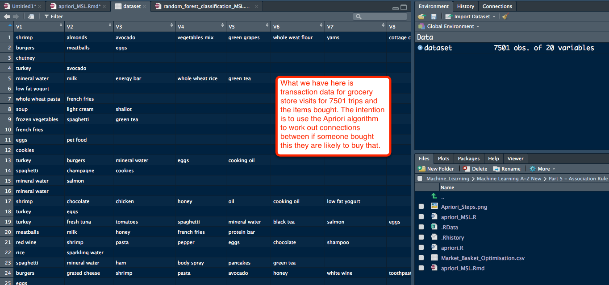

https://en.wikipedia.org/wiki/Association_rule_learning

Intuition lecture 167 https://www.udemy.com/machinelearning/learn/lecture/6455326 

Lecture 169 https://www.udemy.com/machinelearning/learn/lecture/5935024

Eclat only deals with support; this is a simplified version of Apriori algorithm really and what it returns is actually only those items frequently found together from our transactions. 

Check Working directory getwd() to always know where you are working. 
```{r, include=FALSE}
getwd()
```

# Data Preprocessing
First let's import as normal. 
```{r , include=TRUE}
# note we have no headers on our columns so we need to have the read.csv insert a header row. 
dataset = read.csv('Market_Basket_Optimisation.csv', header = FALSE)
```
dataset intro, prior to creating the Sparse Matrix. 
```{r, echo=FALSE, fig.cap="A caption", out.width = '100%'}

```
# Sparse Matrix
We need to import the dataset in a particular way. We have an array, but what Eclat is expecting is a list of lists. To clean things up we'll also remove all the nulls from each row and create a list of lists of all the items for each transaction. To do this we'll create a Sparse Matrix using the arules package. https://en.wikipedia.org/wiki/Sparse_matrix
```{r , message=FALSE,  include=TRUE}
# install.packages('arules')
library(arules)
# rm.duplicates is to remove duplicates because the eclat algorithm cannot have duplicates
dataset = read.transactions('Market_Basket_Optimisation.csv', sep = ',', rm.duplicates = TRUE)
```
The 1 5 references that we have 5 examples of 1 duplicates. 

Let's have a look. 
```{r , include=TRUE}
summary(dataset)
```
# Plot the dataset
itemFrequencyPlot is a function of the arules package library
```{r , include=TRUE, fig.width=10, fig.height=7}
# topN is what top you want to see
itemFrequencyPlot(dataset, topN = 40)
```

# Eclat Steps 
The steps to work through to tune the algorithm. 
```{r, echo=FALSE, fig.cap="A caption", out.width = '100%'}
knitr::include_graphics("Eclat_steps.png")
```

# Training Eclat on the dataset - creating sets of interest
Selecting the Support is not by a rule of thumb, short answer it Depends ;-)
Support is the idea of how frequently is an item 'in the data' so Support is designed to tell the algorithm to ignore certain items that don't show frequently enough. Looking at our graph above of the Frequency we can see as we get out to the right things become less frequent, less impactful and thereby the support will be less. We'll go with things that are purchased 3-4 times a day 3 x 7 = 21 a week / total number of transactions. support: a numeric value for the minimal support of an item set (default: 0.1)
```{r , include=TRUE}
# calculated our support that we want to use
3*7/7500
```
We'll set support at 0.003 to start. The minlen is the idea that we want rule with a minimum length, as in X # of items, we choose two. 
```{r , include=TRUE}
rules = eclat(data = dataset, parameter = list(support = 0.003, minlen = 2 ))
```
The most important bit is how many sets our algorithm wrote. 
writing  ... [1328 set(s)] done [0.02s]. 

# Visualising the results
Eclat gives us the ability to state what we want to sort by, in this case support The 1:10 tells use we want the first 10 lifts, the most common sets of things.  
```{r , include=TRUE, fig.width=10, fig.height=7}
inspect(sort(rules, by = 'support')[1:20])
```

# Adjust support just for fun
How about 4 times a day instead of three, let's calculate that. 
```{r , include=TRUE}
# calculated our support that we want to use
4*7/7500
```
Let's round that to 0.004 
```{r , include=TRUE}
rules = eclat(data = dataset, parameter = list(support = 0.004, minlen = 2 ))
```
writing  ... [845 set(s)] done [0.01s]. Let's look at 20 sets. 
Really there is no change in the top sets, changing the support will only change the number of sets returned because more sets will meett the criteria. 

```{r , include=TRUE, fig.width=10, fig.height=7}
inspect(sort(rules, by = 'support')[1:20])
```


=========================  
Github files; https://github.com/ghettocounselor

Useful PDF for common questions in Lectures;  
https://github.com/ghettocounselor/Machine_Learning/blob/master/Machine-Learning-A-Z-Q-A.pdf