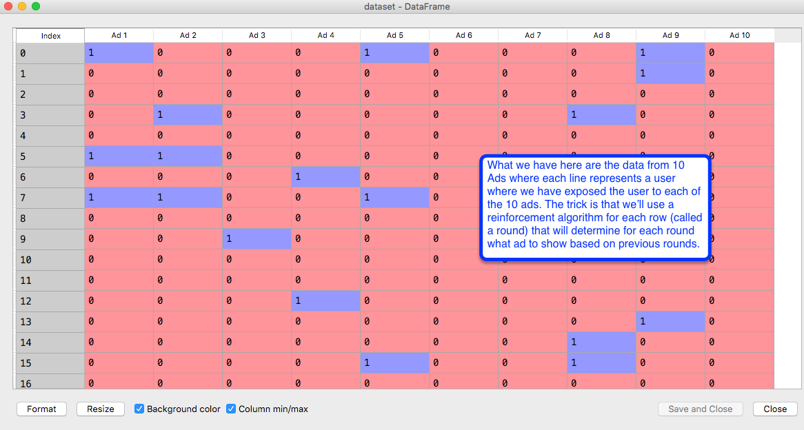
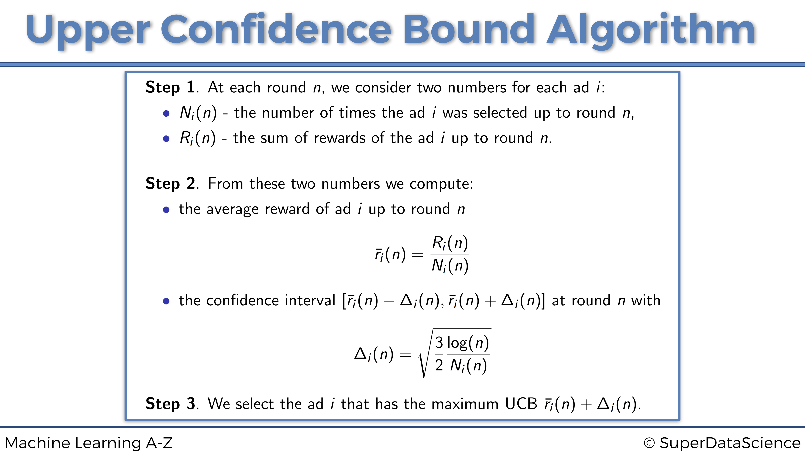

Github files; https://github.com/ghettocounselor

# Upper Confidence Bound - example of Reinforement Learning
Intuition Lecture 172 https://www.udemy.com/machinelearning/learn/lecture/6456832

Import data and implement Random Algorthim Lecture 178 https://www.udemy.com/machinelearning/learn/lecture/6022152

Part 1 Implement/write UCB algorithm Lecture 179 https://www.udemy.com/machinelearning/learn/lecture/6022156

Part 2 Implement/write UCB algorithm Lecture 180 https://www.udemy.com/machinelearning/learn/lecture/6022160

Lecture 181 

# Thompson Sampling wikipedia
# https://papers.nips.cc/paper/4909-eluder-dimension-and-the-sample-complexity-of-optimistic-exploration.pdf

check working directory getwd()
```{r, include=FALSE}
getwd()
```

# Importing the dataset
```{r , include=TRUE}
dataset = read.csv('Ads_CTR_Optimisation.csv')
```

What's this about
```{r, echo=TRUE, fig.cap="Pic from Python but same idea", out.width = '100%'}

```

# Implementing RANDOM Selection - literally random for comparison
```{r , include=TRUE}
N = 10000
d = 10
ads_selected = integer(0)
total_reward = 0
for (n in 1:N) {
  ad = sample(1:10, 1)
  ads_selected = append(ads_selected, ad)
  reward = dataset[n, ad]
  total_reward = total_reward + reward
}
```
Let's have a look at the total rewards calculated at random. 
```{r , include=TRUE}
total_reward
```
# Visualising the results - RANDOM
```{r , include=TRUE, fig.width=10, fig.height=7}
hist(ads_selected,
     col = 'blue',
     main = 'Histogram of ads selections - RANDOM',
     xlab = 'Ads',
     ylab = 'Number of times each ad was selected')
```
# UCB Steps
```{r, echo=TRUE, fig.cap="UCB steps from lecture", out.width = '100%'}

```
# Implementing UCB - to compare to random
Lecture 179 https://www.udemy.com/machinelearning/learn/lecture/6022156
```{r , include=TRUE}
N = 10000 # step 2 bit
d = 10 # step 1 & 2 bit
ads_selected = integer(0) # step 3 bit we create an initial empty vector which the algorithm will fill
numbers_of_selections = integer(d) # step 1 bit we create a vector of size d to start
sums_of_rewards = integer(d) # step 1 bit same idea we need a place to start with vector size d 
total_reward = 0 
# Best described in Lecture 180 https://www.udemy.com/machinelearning/learn/lecture/6022160
for (n in 1:N) { # step 2 bit we'll go through earch round/row stating at 1 and go to N
  ad = 0 # step 3 bit initialize variable at zero
  max_upper_bound = 0 # step 3 bit to initialize the max upper bound at zero
  for (i in 1:d) { # step 2 bit loop through the ads/thing being tested - the first 10 rounds
    if (numbers_of_selections[i] > 0) { # step 2 calculated the Average Reward
      # note this won't be true until after the first 10 rounds ;-) as no add selection will be 
      # greater than zero until after the first pass (10 rounds)
      average_reward = sums_of_rewards[i] / numbers_of_selections[i]
      delta_i = sqrt(3/2 * log(n) / numbers_of_selections[i])
      upper_bound = average_reward + delta_i # step 2 upper end of Confidence Interval
    } else { # set upper bound to a very large number to support the 1st round action
        upper_bound = 1e400 # piece used for the initiazation of the process, where we are testing 
        # with the first 10 we'll loop through, basically the first 10 rounds are to seed our data
        # and in this seeding we don't have an upper bound. 
    }
    if (upper_bound > max_upper_bound) { # step 3 bit to readjust max upper bound on each round
      max_upper_bound = upper_bound
      ad = i
    }
  }
  ads_selected = append(ads_selected, ad) # step 3 bit to continuously add to vector
  numbers_of_selections[ad] = numbers_of_selections[ad] + 1
  reward = dataset[n, ad]
  sums_of_rewards[ad] = sums_of_rewards[ad] + reward
  total_reward = total_reward + reward
}
```

# Visualising the results
```{r , include=TRUE, fig.width=10, fig.height=7}
hist(ads_selected,
     col = 'blue',
     main = 'Histogram of ads selections',
     xlab = 'Ads',
     ylab = 'Number of times each ad was selected')
```


