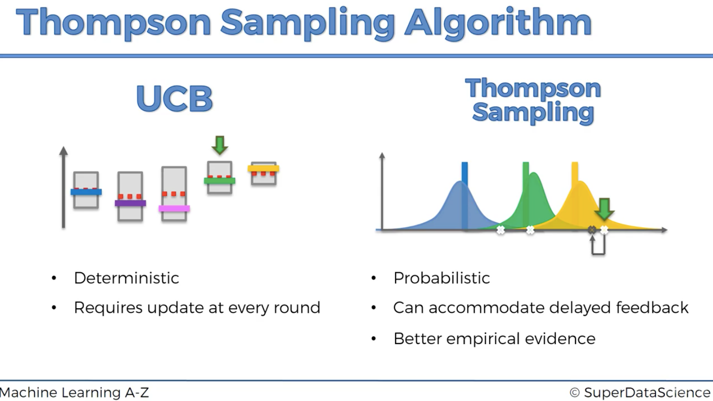
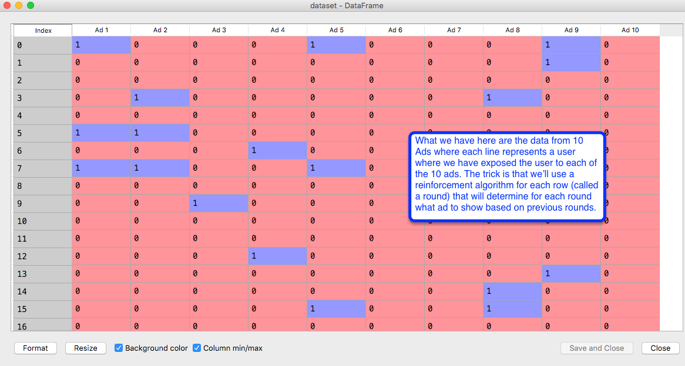
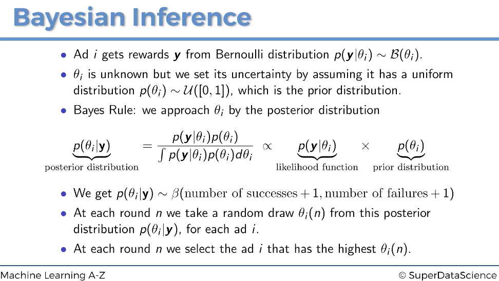

# Thompson Sampling
Thompson Sampling wikipedia  
https://papers.nips.cc/paper/4909-eluder-dimension-and-the-sample-complexity-of-optimistic-exploration.pdf
# Upper Confidence Bound - example of Reinforement Learning
Intuition Lecture 172 https://www.udemy.com/machinelearning/learn/lecture/6456832

Part 1 Lecture 187  
https://www.udemy.com/machinelearning/learn/lecture/6027262

Part 2 Lecture 188  
https://www.udemy.com/machinelearning/learn/lecture/6027270

Beta Distirbution article  
https://www.statisticshowto.datasciencecentral.com/beta-distribution/

check working directory getwd()
```{r, include=FALSE}
getwd()
```

# Importing the dataset
```{r , include=TRUE}
dataset = read.csv('Ads_CTR_Optimisation.csv')
```
UCB compared to Thompson Sampling  
Lecture 183 https://www.udemy.com/machinelearning/learn/lecture/6468288
```{r, echo=TRUE, fig.cap="UCB compared to Thompson Sampling ", out.width = '100%'}

```
What's this about: Python view of data. 
```{r, echo=TRUE, fig.cap="Pic from Python but same idea", out.width = '100%'}

```

# Implementing RANDOM Selection - literally random for comparison
```{r , include=TRUE}
N = 10000
d = 10
ads_selected = integer(0)
total_reward = 0
for (n in 1:N) {
  ad = sample(1:10, 1)
  ads_selected = append(ads_selected, ad)
  reward = dataset[n, ad]
  total_reward = total_reward + reward
}
```
Let's have a look at the total rewards calculated at random. 
```{r , include=TRUE}
total_reward
```
# Visualising the results - RANDOM
As we expect it's Random!
```{r , include=TRUE, fig.width=10, fig.height=7}
hist(ads_selected,
     col = 'blue',
     main = 'Histogram of ads selections - RANDOM',
     xlab = 'Ads',
     ylab = 'Number of times each ad was selected')
```

# Thompson Sampling Steps
```{r, echo=TRUE, fig.cap="UCB steps from lecture", out.width = '100%'}
knitr::include_graphics("Thompson_Sampling_Slide.png")
```
# Implementing Thompson Sampling
```{r , include=TRUE}
N = 10000
d = 10
ads_selected = integer(0)
# UCB and Thompson Sampling algorithm are very similar but use different variables
# those variables are here
numbers_of_rewards_1 = integer(d) # the d defined above sets the initial as 10
numbers_of_rewards_0 = integer(d)
# These two variables will be put in place in the for loops
total_reward = 0
for (n in 1:N) {
  ad = 0
  max_random = 0
  for (i in 1:d) {
    random_beta = rbeta(n = 1,
                        shape1 = numbers_of_rewards_1[i] + 1,
                        shape2 = numbers_of_rewards_0[i] + 1)
    if (random_beta > max_random) {
      max_random = random_beta
      ad = i
    }
  }
  ads_selected = append(ads_selected, ad)
  reward = dataset[n, ad]
  if (reward == 1) {
    numbers_of_rewards_1[ad] = numbers_of_rewards_1[ad] + 1
  } else {
    numbers_of_rewards_0[ad] = numbers_of_rewards_0[ad] + 1
  }
  total_reward = total_reward + reward
}
```
Let's have a look at the total rewards calculated with Thompson Sampling to compare to Random. 
```{r , include=TRUE}
total_reward
```
# Bayesian Inference
Describes the bits at the root of Thompson Sampling.  
https://en.wikipedia.org/wiki/Bayesian_inference  
https://brohrer.github.io/how_bayesian_inference_works.html 
```{r, echo=TRUE, fig.cap="UCB steps from lecture", out.width = '100%'}

```
# Visulize the ads selected data
Let's look at the last 1000 items to see which add is looking the most common. 
```{r , include=TRUE}
tail(ads_selected, n = 1000)
```
# Visualising the results
```{r , include=TRUE, fig.width=10, fig.height=7}
hist(ads_selected,
     col = 'blue',
     main = 'Histogram of ads selections (Thompson Sampling R)',
     xlab = 'Ads',
     ylab = 'Number of times each ad was selected')
```
Great question: How is Thomson Sampling heuristic quickly able to find that 5th advertisement is the best one in comparison to the Upper Confidence Bound heuristic?  
It is hard to explain the reason theoretically, that would require to do research and write a long mathematical proof. But intuitively, it could be because UCB is based on optimistic assumptions whereas Thompson Sampling is based on relevant probabilities through the Bayesian approach.
=========================  
Github files; https://github.com/ghettocounselor

Useful PDF for common questions in Lectures;  
https://github.com/ghettocounselor/Machine_Learning/blob/master/Machine-Learning-A-Z-Q-A.pdf
