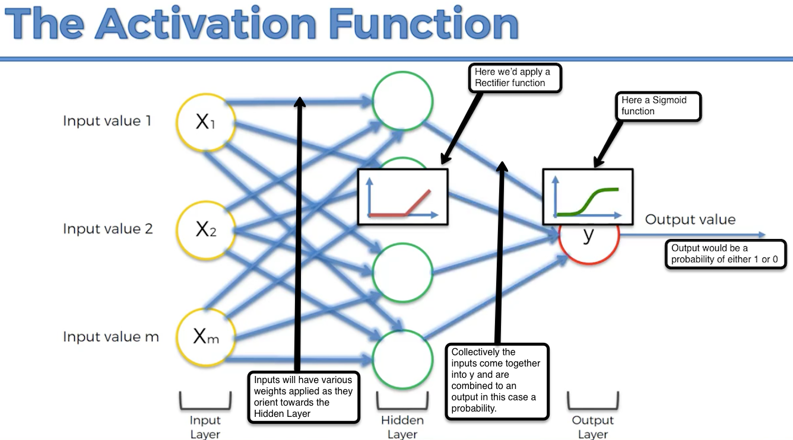
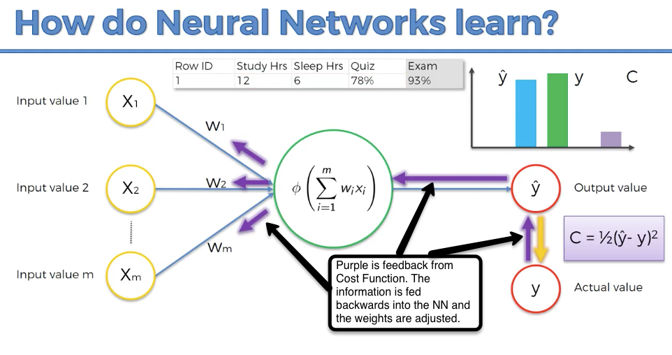
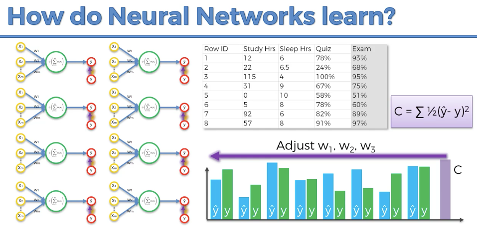
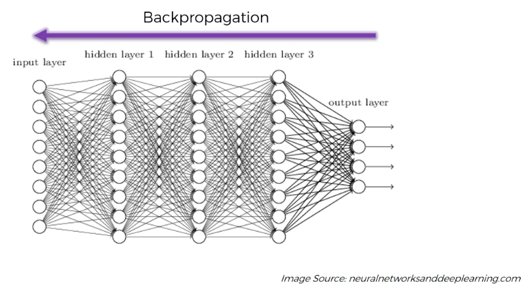
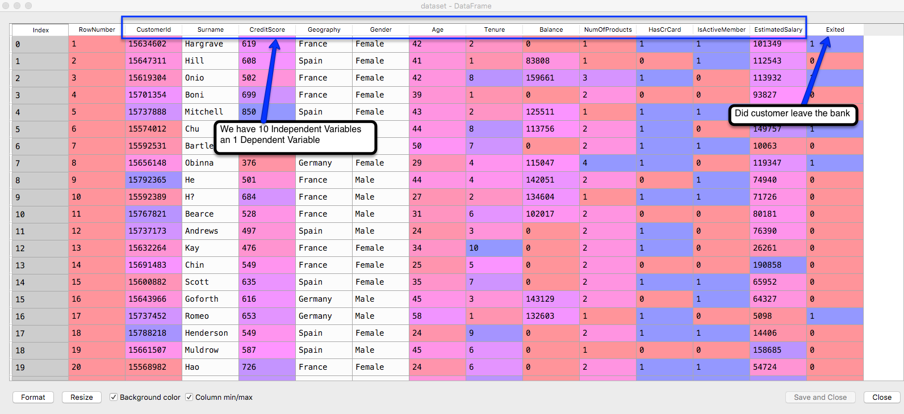
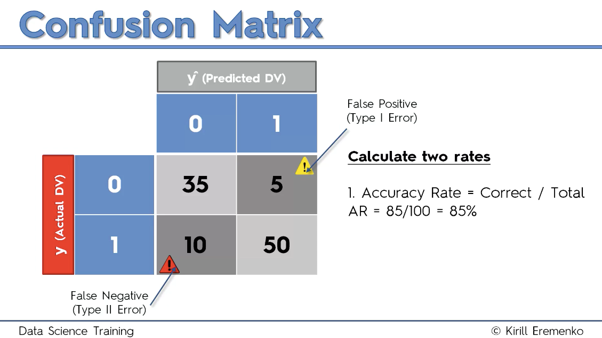

# How do neural networks work?
Lecture 219 https://www.udemy.com/machinelearning/learn/lecture/6760386  
Outline of Neural Netword Activation Function use
```{r, echo=TRUE, fig.cap="UCB steps from lecture", out.width = '100%'}

```

# How do Neural Networks learn? 
The Cost Function is the difference between the y^ prediction and y the actual value, so the lower the Cost Function the higer the accuracy of the NN. This process is refferred to as back propagation.  
Lecture 220 https://www.udemy.com/machinelearning/learn/lecture/6760388  
```{r, echo=TRUE, fig.cap="UCB steps from lecture", out.width = '100%'}

```
```{r, echo=TRUE, fig.cap="UCB steps from lecture", out.width = '100%'}

```
```{r, echo=TRUE, fig.cap="UCB steps from lecture", out.width = '100%'}

```

Nicely done post : https://stats.stackexchange.com/questions/154879/a-list-of-cost-functions-used-in-neural-networks-alongside-applications   

# Gradient Descent, Curse of Dimensionality, nuances to adjustment of weights. 
The require a convex relationship of y and Cost Function. Gradient Descent is also called batch gradient descent.   
Lecture 221 https://www.udemy.com/machinelearning/learn/lecture/6760390  

# Stochastic Gradient Descent
This does not require convex relationship. This is NOT a batch process, it's running each row (each weight) at a time. This allows the proces to find the BEST Cost Function even if relationship of y to C is not convex.  
Lecture 222 https://www.udemy.com/machinelearning/learn/lecture/6760392  

# Backpropagation 
Lecture 223 https://www.udemy.com/machinelearning/learn/lecture/6760394  
Good post http://neuralnetworksanddeeplearning.com/chap2.html#the_four_fundamental_equations_behind_backpropagation 

ANN in R Lectures  
Lecture 237 https://www.udemy.com/machinelearning/learn/lecture/6142016  
Lecutre 238 https://www.udemy.com/machinelearning/learn/lecture/6145488  
Lecture 239 https://www.udemy.com/machinelearning/learn/lecture/6210372  
Lecture 240 https://www.udemy.com/machinelearning/learn/lecture/6147564  

check working directory getwd()
```{r, include=FALSE}
getwd()
```

# Importing the dataset
```{r , include=TRUE}
dataset = read.csv('Churn_Modelling.csv')
```

Let's have a look at the variables. (Python image below). We have 10 Independent variables from index 4 to 13 and the Dependent variable is 14 'Exited'. Because of this we'll strip the dataset down to the group of Independent and Dependent variables only. Indexes in R start at 1. 
```{r , include=TRUE}
dataset = dataset[4:14]
```

```{r, echo=TRUE, fig.cap="Python view of dataset", out.width = '100%'}

```

# Encoding the categorical variables as factors
Geography (country) and Gender need to be made into factors. Our dependent variable is already binary and needs no adjustment. Our deep learning package requires this processing. 
```{r,  include=TRUE}
dataset$Geography = as.numeric(factor(dataset$Geography,
                                      levels = c('France', 'Spain', 'Germany'),
                                      labels = c(1, 2, 3)))
dataset$Gender = as.numeric(factor(dataset$Gender,
                                   levels = c('Female', 'Male'),
                                   labels = c(1, 2)))
```

# Splitting the dataset into the Training set and Test set
We'll train on the Training set and test on Test set
```{r, include=TRUE}
# install.packages('caTools')
library(caTools)
set.seed(123)
split = sample.split(dataset$Exited, SplitRatio = 0.8)
training_set = subset(dataset, split == TRUE)
test_set = subset(dataset, split == FALSE)
```

# Feature Scaling
Needed in order to ease all the calculations we'll be doing. It is required by the package we'll be using for calculations. The -11 is to reference that we want to feature scale all the elements except the last column, the Exited column. 
```{r , include=TRUE}
training_set[-11] = scale(training_set[-11])
test_set[-11] = scale(test_set[-11])
```

# Fitting ANN to the Training set - h2o package
h2o package - https://cran.r-project.org/web/packages/h2o/h2o.pdf  
Gettng H2O going.
```{r , include=TRUE}
# install.packages('h2o')
library(h2o)
h2o.init(nthreads = -1) # always use -1 if you are running on a basic computer
```
# Train the model creating classifier
```{r , include=TRUE}
classifier = h2o.deeplearning(y = 'Exited', # y is the name of the Dependent variable
                  # we need to make an H2o dataframe because we have a plain dataframe
                         training_frame = as.h2o(training_set), 
                         activation = 'Rectifier', # this is activation function
                         hidden = c(6,6), # as a vector the number of hidden layers and vectors
                  # chosing the nodes rule of thumb is to use variables 10 + 1 / 2 = 5.5 ;) we'll
                  # use 6 (note the 2 is for the 2 groups)
                         epochs = 100, # how many times the dataset will be iterated
                         train_samples_per_iteration = -2) # -2 is autotune :-)
```

# Predicting the Test set results
This will provide us with an 'Environment'
```{r , include=TRUE}
prob_pred = h2o.predict(classifier, newdata = as.h2o(test_set[-11])) # -11 is the index of dependent variable. Again H2O needs a h2o dataframe
```
We need to turn the propabilities provided by predict into 
```{r , include=TRUE}
# the 0.5 is a threshold
# y_pred = ifelse(prod_pred > 0.5, 1, 0) # this can be written simpler as
y_pred = (prob_pred > 0.5)
```
Still an environment, so convert back to vector
```{r , include=TRUE}
y_pred = as.vector(y_pred)
```

# Making the Confusion Matrix
```{r , include=TRUE}
cm = table(test_set[, 11], y_pred) # 11 is the index of the dependent variable
```

```{r , include=TRUE}
cm
```
```{r, echo=TRUE, fig.cap="UCB steps from lecture", out.width = '100%'}

```
# Accuracy of our Model
TP = # True Positives  
TN = # True Negatives  
FP = # False Positives  
FN = # False Negatives  
Accuracy = (TP + TN) / (TP + TN + FP + FN)  
```{r , include=TRUE}
(1551 + 166) / 2000
```
Shutdown of h20 server;
```{r , include=TRUE}
h2o.shutdown()
```

=========================  
Github files; https://github.com/ghettocounselor

Useful PDF for common questions in Lectures;  
https://github.com/ghettocounselor/Machine_Learning/blob/master/Machine-Learning-A-Z-Q-A.pdf