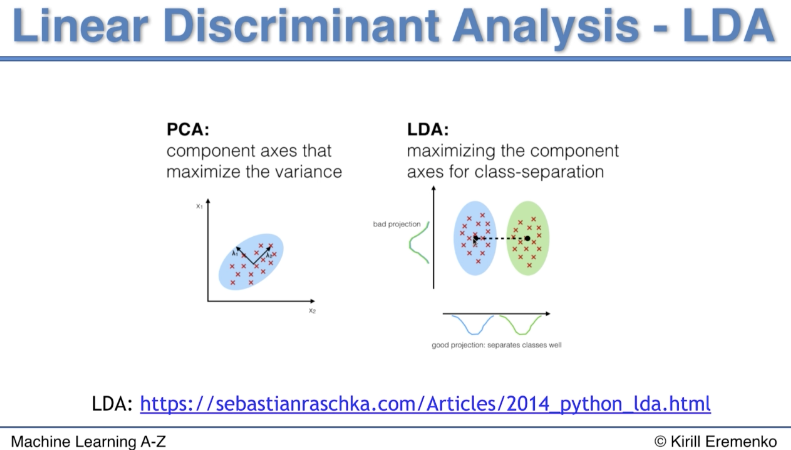

Lecture 272 Intuition https://www.udemy.com/machinelearning/learn/lecture/10628136  
Lecture 274 https://www.udemy.com/machinelearning/learn/lecture/6453304  


```{r, echo=TRUE, fig.cap="", out.width = '100%'}

```

Both Linear Discriminant Analysis (LDA) and Principal Component Analysis (PCA) are  
linear transformation techniques that are commonly used for dimensionality reduction. 
PCA can be described as an “unsupervised” algorithm, since it “ignores” class labels and 
its goal is to find the directions (the so-called principal components) that maximize 
the variance in a dataset. In contrast to PCA, LDA is “supervised” and computes the 
directions (“linear discriminants”) that will represent the axes that that maximize the 
separation between multiple classes.  
https://sebastianraschka.com/Articles/2014_python_lda.html  is Python but explanation is good.

check working directory getwd()
```{r, include=FALSE}
getwd()
```

# Importing the dataset
```{r, include=TRUE}
dataset = read.csv('Wine.csv')
```

```{r, echo=TRUE, fig.cap="Python view of dataset", out.width = '100%'}
knitr::include_graphics("Datasetinformation.png")
```

# Splitting the dataset into the Training set and Test set
```{r, include=TRUE}
# install.packages('caTools')
library(caTools)
set.seed(123)
split = sample.split(dataset$Customer_Segment, SplitRatio = 0.8)
training_set = subset(dataset, split == TRUE)
test_set = subset(dataset, split == FALSE)
```

# Feature Scaling
```{r, include=TRUE}
training_set[-14] = scale(training_set[-14])
test_set[-14] = scale(test_set[-14])
```

# Applying LDA
```{r, include=TRUE}
library(MASS)
lda = lda(formula = Customer_Segment ~ ., data = training_set)
training_set = as.data.frame(predict(lda, training_set)) # LDA needs a datafram, in PCA we got a dataframe in our preprocessing
```

```{r, include=TRUE}
head(training_set)
```
Lets clean up the columns and get them in order
```{r, include=TRUE}
training_set = training_set[c(5, 6, 1)] # we need to get the columns in the right order
# same for the test set
test_set = as.data.frame(predict(lda, test_set)) # LDA needs a datafram, in PCA we got a dataframe in our preprocessing
test_set = test_set[c(5, 6, 1)]
```

```{r, include=TRUE}
head(training_set)
```

# Fitting SVM to the Training set
```{r, include=TRUE}
# install.packages('e1071')
library(e1071)
classifier = svm(formula = class ~ .,  # note the customer segment is now called class
                 data = training_set,
                 type = 'C-classification',
                 kernel = 'linear')
```

# Predicting the Test set results
```{r, include=TRUE}
y_pred = predict(classifier, newdata = test_set[-3])
```

# Making the Confusion Matrix
```{r, include=TRUE}
cm = table(test_set[, 3], y_pred)
cm
```

# Visualising the Training set results
```{r, include=TRUE, fig.width=10, fig.height=7}
library(ElemStatLearn)
set = training_set
X1 = seq(min(set[, 1]) - 1, max(set[, 1]) + 1, by = 0.01)
X2 = seq(min(set[, 2]) - 1, max(set[, 2]) + 1, by = 0.01)
grid_set = expand.grid(X1, X2)
colnames(grid_set) = c('x.LD1', 'x.LD2')  # note here we need the real names of the extracted features
y_grid = predict(classifier, newdata = grid_set)
plot(set[, -3],
     main = 'Linear Discriminant Analysis (LDA) (Training set)',
     xlab = 'LD1', ylab = 'LD2',
     xlim = range(X1), ylim = range(X2))
contour(X1, X2, matrix(as.numeric(y_grid), length(X1), length(X2)), add = TRUE)
points(grid_set, pch = '.', col = ifelse(y_grid == 2, 'deepskyblue', ifelse(y_grid == 1, 'springgreen3', 'tomato')))
points(set, pch = 21, bg = ifelse(set[, 3] == 2, 'blue3', ifelse(set[, 3] == 1, 'green4', 'red3')))
```

# Visualising the Test set results
```{r, include=TRUE, fig.width=10, fig.height=7}
library(ElemStatLearn)
set = test_set
X1 = seq(min(set[, 1]) - 1, max(set[, 1]) + 1, by = 0.01)
X2 = seq(min(set[, 2]) - 1, max(set[, 2]) + 1, by = 0.01)
grid_set = expand.grid(X1, X2)
colnames(grid_set) = c('x.LD1', 'x.LD2') # note here we need the real names of the extracted features
y_grid = predict(classifier, newdata = grid_set)
plot(set[, -3], main = 'Linear Discriminant Analysis (LDA) (Test set)',
     xlab = 'LD1', ylab = 'LD2',
     xlim = range(X1), ylim = range(X2))
contour(X1, X2, matrix(as.numeric(y_grid), length(X1), length(X2)), add = TRUE)
points(grid_set, pch = '.', col = ifelse(y_grid == 2, 'deepskyblue', ifelse(y_grid == 1, 'springgreen3', 'tomato')))
points(set, pch = 21, bg = ifelse(set[, 3] == 2, 'blue3', ifelse(set[, 3] == 1, 'green4', 'red3')))
```