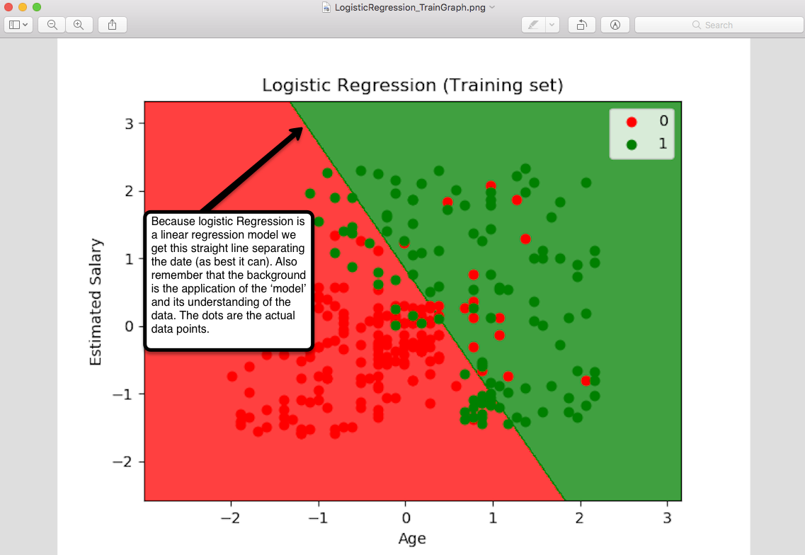
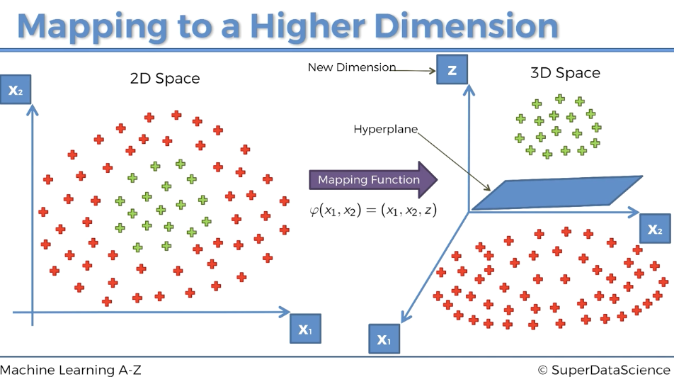
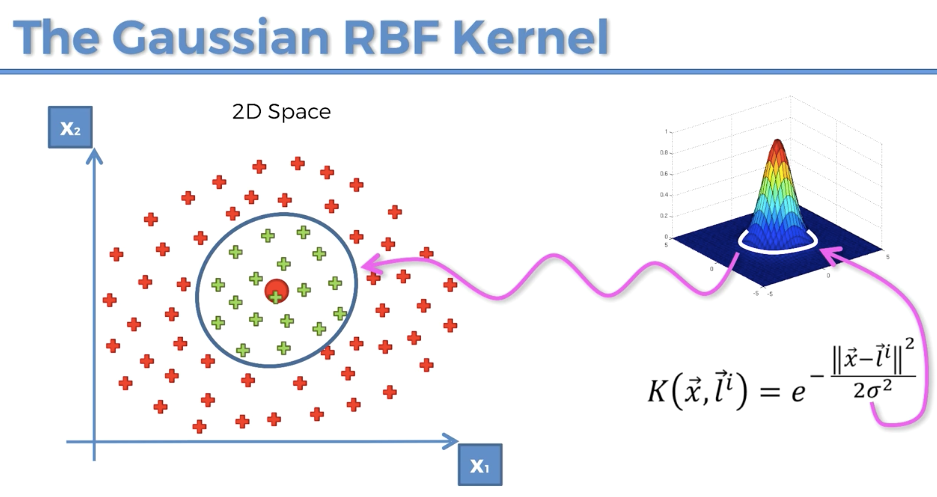
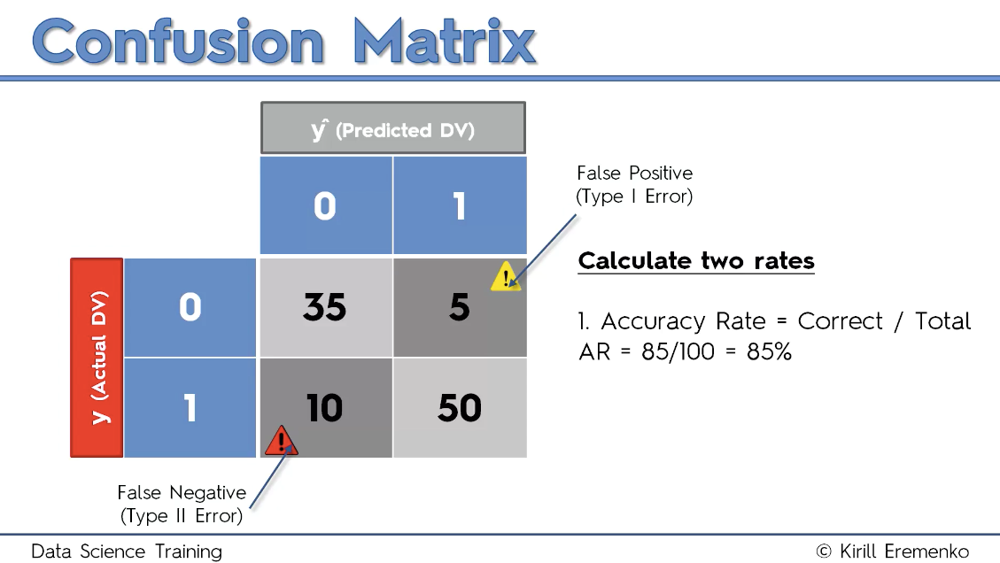
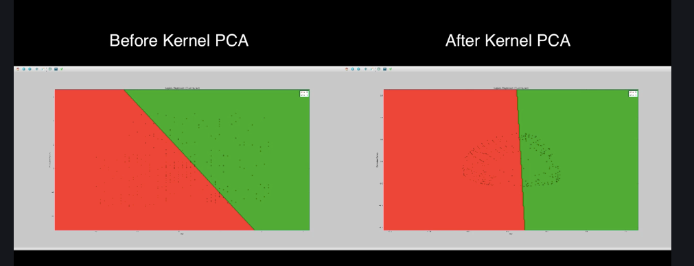

Lecture 277 https://www.udemy.com/machinelearning/learn/lecture/6270782  
Remember that we have non-linearly separable data here so we don't want to use LDA or PCA (alone) 
Let's remember our Logistic Regression Model example from classification part of the course. This allows us to see that our data is not linearly separable. 
```{r, echo=TRUE, fig.cap="", out.width = '100%'}

```

# Kernel PCA
Basically what we'll be doing here is applying Kernel PCA to our data before we then apply a linear model. This application is called the Kernel Trick. 

check working directory getwd()
```{r, include=FALSE}
getwd()
```
# Importing the dataset
```{r, include=TRUE}
dataset = read.csv('Social_Network_Ads.csv')
dataset = dataset[, 3:5]
```

# Splitting the dataset into the Training set and Test set
```{r, include=TRUE}
# install.packages('caTools')
library(caTools)
set.seed(123)
split = sample.split(dataset$Purchased, SplitRatio = 0.75)
training_set = subset(dataset, split == TRUE)
test_set = subset(dataset, split == FALSE)
```
# Feature Scaling
```{r, include=TRUE}
training_set[, 1:2] = scale(training_set[, 1:2])
test_set[, 1:2] = scale(test_set[, 1:2])
```
# Applying Kernel PCA
This is the new bit, the Kernel Trick :~)
```{r, include=TRUE}
# install.packages('kernlab')
library(kernlab)
# ~ . is our entire 'model', our X
# our data is our data without the dependent variable
# our Gausian Kernel 
# features is the heart of dimensionality reductions, again we want to use 2 so we can visualize.
kpca = kpca(~., data = training_set[-3], kernel = 'rbfdot', features = 2)
```
# What's going on
The Kernel Trick maps the data to a New Higher Dimension where the data 'is' linerally separable by the Hyperplane. 
```{r, echo=TRUE, fig.cap="", out.width = '100%'}

```
Visually the math looks like this;
```{r, echo=TRUE, fig.cap="", out.width = '100%'}

```

Now lets build our datasets with our new object kpca
```{r, include=TRUE}
training_set_pca = as.data.frame(predict(kpca, training_set))
```
Let's look; we removed the dependent variable above to apply the dimensionality reduction but we'll need it so lets move it back in. 
```{r, include=TRUE}
head(training_set_pca)
```
```{r, include=TRUE}
training_set_pca$Purchased = training_set$Purchased
```
And now we have our data ready for fitting to our regression. 
```{r, include=TRUE}
head(training_set_pca)
```
Let's fix the test set. 
```{r, include=TRUE}
test_set_pca = as.data.frame(predict(kpca, test_set))
test_set_pca$Purchased = test_set$Purchased
```
# Fitting Logistic Regression to the Training set
```{r, include=TRUE}
classifier = glm(formula = Purchased ~ .,
                 family = binomial,
                 data = training_set_pca)
```
# Predicting the Test set results
```{r, include=TRUE}
prob_pred = predict(classifier, type = 'response', newdata = test_set_pca[-3])
y_pred = ifelse(prob_pred > 0.5, 1, 0)
```
# Making the Confusion Matrix
```{r, include=TRUE}
cm = table(test_set_pca[, 3], y_pred)
```
```{r, include=TRUE}
cm
```
```{r, echo=TRUE, fig.cap="", out.width = '100%'}

```
# Visualising the Training set results
```{r, include=TRUE}
# install.packages('ElemStatLearn')
library(ElemStatLearn)
set = training_set_pca
X1 = seq(min(set[, 1]) - 1, max(set[, 1]) + 1, by = 0.01)
X2 = seq(min(set[, 2]) - 1, max(set[, 2]) + 1, by = 0.01)
grid_set = expand.grid(X1, X2)
colnames(grid_set) = c('V1', 'V2') # align with PC1 and PC2
prob_set = predict(classifier, type = 'response', newdata = grid_set)
y_grid = ifelse(prob_set > 0.5, 1, 0)
plot(set[, -3],
     main = 'Logistic Regression with Kernel PCA (Training set)',
     xlab = 'PC1', ylab = 'PC2',
     xlim = range(X1), ylim = range(X2))
contour(X1, X2, matrix(as.numeric(y_grid), length(X1), length(X2)), add = TRUE)
points(grid_set, pch = '.', col = ifelse(y_grid == 1, 'springgreen3', 'tomato'))
points(set, pch = 21, bg = ifelse(set[, 3] == 1, 'green4', 'red3'))
```
# Visualising the Test set results
```{r, include=TRUE}
# install.packages('ElemStatLearn')
library(ElemStatLearn)
set = test_set_pca
X1 = seq(min(set[, 1]) - 1, max(set[, 1]) + 1, by = 0.01)
X2 = seq(min(set[, 2]) - 1, max(set[, 2]) + 1, by = 0.01)
grid_set = expand.grid(X1, X2)
colnames(grid_set) = c('V1', 'V2') # align with PC1 and PC2
prob_set = predict(classifier, type = 'response', newdata = grid_set)
y_grid = ifelse(prob_set > 0.5, 1, 0)
plot(set[, -3],
     main = 'Logistic Regression with Kernel PCA (Test set)',
     xlab = 'V1 (PC1)', ylab = 'V2 (PC2)',
     xlim = range(X1), ylim = range(X2))
contour(X1, X2, matrix(as.numeric(y_grid), length(X1), length(X2)), add = TRUE)
points(grid_set, pch = '.', col = ifelse(y_grid == 1, 'springgreen3', 'tomato'))
points(set, pch = 21, bg = ifelse(set[, 3] == 1, 'green4', 'red3'))
```

```{r, echo=TRUE, fig.cap="", out.width = '100%'}

```